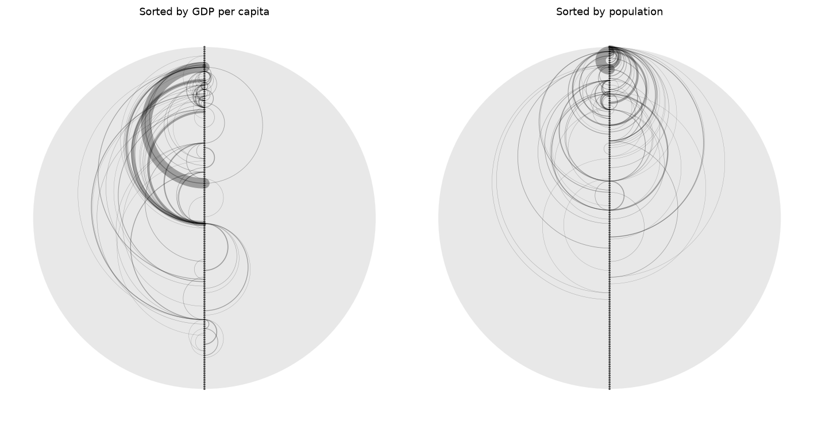
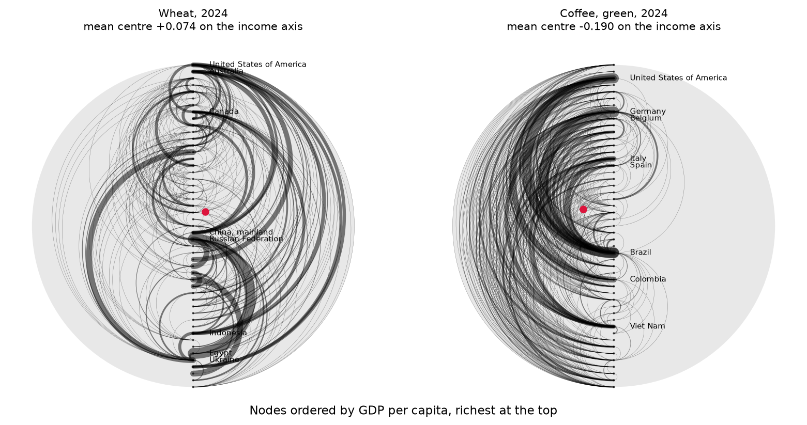

[English](README.md) | **한국어**

# halfcircle

양방향 흐름 데이터를 한눈에 읽는 도구.



노드를 원의 중심선 위에 늘어놓고, 각 흐름을 출발지에서 도착지로 **시계방향 반원**으로 그립니다. 그래서 A→B와 B→A는 반대쪽으로 부풀어 서로 겹치지 않습니다. 노드 순서를 바꾸면 그림이 흩어지거나 한 방향으로 정렬되는데, **그 비교가 곧 분석입니다.**

2018년 CRAN에 올린 [동명의 R 패키지](https://cran.r-project.org/src/contrib/Archive/halfcircle/)(Park & Xiao)를 파이썬으로 다시 쓰고, 정렬을 체계적으로 비교하는 기능을 더했습니다.

## 설치

```bash
pip install git+https://github.com/wherewindstay/halfcircle.git
```

## 기본 사용법

```python
from halfcircle import halfcircle, load_trade

flow, node = load_trade()                    # 작물 교역에 내재된 토지, 154개국
flow = flow.loc[flow["vegetable"] > 5000, ["O", "D", "vegetable"]]
node = node.sort_values("gdpc", ascending=False)

halfcircle(flow, node, orientation="vertical", labels=False, drop_missing=True)
```

`flow`는 열 위치로 읽습니다 — 출발지, 도착지, 크기. R 패키지에 쓰던 파일을 그대로 넣을 수 있습니다.

## 어떤 순서가 의미 있는지 찾기

이 다이어그램은 순서를 바꿔 비교해야 말을 합니다. `compare_orders`는 그 비교를 수치로 합니다 — 각 정렬에서 모든 반원의 평균중심이 원점에서 얼마나 벗어나는지 알려줍니다. 원점에 가까우면 흐름이 상쇄된다는 뜻이고, 한쪽으로 크게 밀리면 물량이 일관되게 한 방향으로 흐른다는 뜻입니다.

```python
from halfcircle import compare_orders

compare_orders(flow, {
    "1인당 GDP": node.sort_values("gdpc", ascending=False),
    "인구":      node.sort_values("pop_total", ascending=False),
    "경작면적":  node.sort_values("area_cultivation", ascending=False),
    "알파벳순":  node.sort_values("country"),
}, drop_missing=True)
```

```
    order  x_weighted  y_weighted  distance
       인구   -0.722115    0.006337  0.722143
     경작면적   -0.632828    0.028257  0.633458
  1인당 GDP   -0.415186   -0.077493  0.422356
     알파벳순    0.080736    0.061077  0.101236
```

인구 순으로 배열했을 때 평균중심이 가장 멀리(0.72) 밀려나고, 알파벳순은 원점 근처(0.10)에 머뭅니다 — 의미 없는 정렬이라면 마땅히 그래야 합니다. 이 흐름을 조직하는 축은 소득이 아니라 인구라는 뜻입니다.

읽는 대신 보고 싶다면:

```python
from halfcircle import inspect

inspect(flow, {"1인당 GDP": node.sort_values("gdpc", ascending=False),
               "인구":      node.sort_values("pop_total", ascending=False)},
        orientation="vertical", labels=False, drop_missing=True)
```

각 패널에 평균중심까지의 거리가 표시되고 그 위치가 붉은 점으로 찍힙니다.

## 두 작물을 같은 축에 놓기

`load_faostat()`은 FAOSTAT Detailed Trade Matrix에서 뽑은 밀과 커피(생두)의 2000~2024년 교역을 담고 있습니다. 같은 소득축 위에 그리면 두 작물이 축의 반대편에 자리합니다.



```python
from halfcircle import halfcircle, load_faostat, load_faostat_nodes

nodes = load_faostat_nodes().dropna(subset=["gdpc"])
order = nodes.sort_values("gdpc", ascending=False)

flow, _ = load_faostat("coffee", 2024, min_volume=500, top_k=50)
halfcircle(flow, order, orientation="vertical", drop_missing=True,
           labels={"Brazil", "Colombia", "Viet Nam", "United States of America"})
```

커피의 평균중심은 −0.190입니다. 거의 모든 반원이 소득이 낮은 생산국에서 높은 소비국으로 향합니다. 밀은 +0.074로 가운데에 가깝습니다. 주요 수출국(미국·호주·캐나다·프랑스)이 그 자체로 고소득국이고 양방향으로 나가기 때문에, 소득축으로 설명되는 것이 적습니다.

위 코드에서 두 가지를 눈여겨봐 두면 좋습니다. `labels`에 **이름 집합**을 주면 그 노드에만 이름이 붙습니다 — 50개국을 한 줄에 세우고 이름을 다 찍으면 서로 뭉개지므로 기준점 몇 개만 두는 편이 읽힙니다. 그리고 정렬 전의 `dropna`는 장식이 아닙니다. `sort_values`는 결측을 맨 뒤로 보내는데, 이 축에서 맨 뒤는 "가장 가난함"을 뜻합니다. 대만은 FAOSTAT에 GDP가 없어서, 저 줄이 없으면 소득축 최하단에 그려집니다.

그림은 `examples/faostat.py`로 다시 만들 수 있습니다.

## 이 패턴이 진짜인가

다이어그램은 언제나 무언가처럼 보입니다. `order_significance`는 그 정렬이 아무 정렬보다 나은지 묻습니다 — 노드를 수백 번 무작위로 섞어 평균중심 거리의 귀무분포를 만들고, 실제 정렬이 그 안에서 어디에 있는지 알려줍니다.

```python
from halfcircle import order_significance

res = order_significance(flow, node.sort_values("income_level"),
                         orientation="vertical", n_permutations=999,
                         drop_missing=True)
print(res.summary())
```

```
mean centre 0.419 from origin (random orderings: 0.115 ± 0.073) — p = 0.0033, stronger than chance
```

x·y 성분도 따로 검정합니다. 둘은 뜻이 다르기 때문입니다. `orientation="vertical"`에서 `p_x`는 **방향 편향** — 물량이 정렬을 따라 한쪽으로 얼마나 일관되게 흐르는지 — 을, `p_y`는 **정렬의 어느 구간에** 흐름이 몰리는지를 봅니다. 위 결과는 `p_y = 0.003`인데 `p_x = 0.27`입니다. 소득수준은 *어느 나라가* 교역하는지를 가르지만 방향까지 정하지는 않는다는 뜻입니다.

### 두 흐름이 다른가

곡물과 채소, 또는 같은 품목의 10년 전과 후 — 같은 질문이고 같은 검정입니다. `compare_flows`는 두 표의 모든 엣지를 합친 뒤 집단 크기를 유지한 채 무작위로 다시 나누고, 두 평균중심이 실제만큼 벌어지는 일이 얼마나 흔한지 봅니다.

```python
from halfcircle import compare_flows

res = compare_flows(vegetables, cereals, node.sort_values("income_level"),
                    label_a="vegetables", label_b="cereals",
                    orientation="vertical", drop_missing=True)
print(res.summary())
```

```
vegetables (0.419) and cereals (0.225) differ: centres 0.237 apart, p = 0.0167
```

## 시간에 따른 변화 추적

Park, Munroe, Xiao (2023)는 곡물 교역 40년을 시기별 다이어그램으로 읽었습니다. `track`은 그 비교를 수치로 만듭니다 — 각 시기가 평균중심 한 점으로 압축되고, 그 점들이 그리는 궤적이 곧 발견입니다.

```python
from halfcircle import track, plot_track

periods = {"1988-90": f1, "1998-00": f2, "2008-10": f3, "2018-20": f4}
track(periods, node.sort_values("income_level"), orientation="vertical")
```

각 행에 평균중심, 원점과의 거리, 직전 시기 대비 이동량, 그리고 두 성분을 나눈 `skew_axis`(방향 편향)와 `spread_axis`(정렬 내 위치)가 담깁니다. `plot_track`은 그 궤적을 그리되 나중 시기일수록 점을 크게 찍습니다.

## 함수

| 함수 | 하는 일 |
|---|---|
| `halfcircle(flow, nodes, ...)` | 다이어그램을 그리고 matplotlib `Axes`를 반환 |
| `inspect(flow, orders, ...)` | 같은 흐름을 여러 정렬로 나란히 그림 |
| `mean_center(flow, nodes, ...)` | 모든 반원의 가중·비가중 평균중심 |
| `compare_orders(flow, orders, ...)` | 여러 정렬의 평균중심을 거리순으로 비교 |
| `plot_mean_center(flow, nodes, ...)` | 다이어그램을 평균중심 두 점으로 축약 |
| `order_significance(flow, nodes, ...)` | 순열검정: 이 정렬이 무작위보다 나은가 |
| `compare_flows(a, b, nodes, ...)` | 순열검정: 두 흐름의 구조가 다른가 |
| `track(periods, nodes, ...)` | 시기별 평균중심과 이동량 |
| `plot_track(periods, nodes, ...)` | 평균중심이 그리는 궤적 |
| `node_positions`, `arc_points`, `flow_arcs` | 기하 계산만 — 직접 그리고 싶을 때 |
| `load_trade()`, `load_flow()`, `load_nodes()` | 가상 토지 교역 — R 패키지의 데이터 |
| `load_faostat(item, year, ...)` | FAOSTAT 밀·커피 교역, 2000~2024 |

`flow_color`, `flow_width`, `node_color`, `labels`는 R 패키지와 같이 단일 값 또는 행마다 하나씩 받습니다. 속성별로 색을 나누거나 특정 노드만 강조할 수 있습니다. 행마다 준 값은 넘겨준 `flow`의 행에 맞춰지므로, `drop_missing`으로 일부가 빠져도 어긋나지 않습니다. `labels`는 노드 이름의 집합도 받습니다 — 순서와 무관하므로 `inspect`의 여러 패널에 그대로 써도 됩니다.

## 사용 예시

**한 나라가 걸린 흐름만 강조**

```python
colors = ["crimson" if "China" in (o, d) else "#dddddd"
          for o, d in zip(flow["O"], flow["D"])]
halfcircle(flow, node, flow_color=colors, orientation="vertical", labels=False)
```

**출발지 속성별로 색 나누기**

```python
palette = {"1. High income": "#22abcb", "2. Upper middle income": "#4eb6ad",
           "3. Middle income": "#86c388", "4. Lower middle income": "#adcd6c",
           "5. Low income": "#dad84f"}
lookup = node.set_index("country")["income_level"].map(palette)
halfcircle(flow, node, flow_color=[lookup.get(o, "gray") for o in flow["O"]],
           orientation="vertical", labels=False)
```

**보고 싶은 나라만 이름 붙이기**

```python
watch = {"China", "United States", "Brazil"}
halfcircle(flow, node, labels=[n if n in watch else "" for n in node["country"]],
           label_size=7, orientation="vertical")
```

**품목별로 나란히 비교**

```python
inspect({"채소": veg, "밀": wheat, "대두": soy}, ...)
```

**matplotlib 없이 기하만 쓰기**

```python
from halfcircle import flow_arcs
for arc in flow_arcs(flow, node, orientation="vertical"):
    ...  # arc.x, arc.y, arc.volume, arc.radius — 원하는 렌더러에 넘기면 됩니다
```

## R 원본 패키지

2018년 CRAN 배포본이 아카이브돼 있어, 소스 tarball을 [`r-legacy/`](r-legacy/)에 함께 보관했습니다. 그대로 설치해 쓸 수 있습니다.

```r
install.packages("r-legacy/halfcircle_0.1.0.tar.gz", repos = NULL, type = "source")
```

## 알아둘 점

- 자기 자신으로 가는 흐름(출발지=도착지)은 그리지 않고, 평균중심 계산에서도 뺍니다.
- `flow`에는 있는데 `nodes`에 없는 노드가 있으면 오류를 냅니다. 건너뛰려면 `drop_missing=True`를 주세요.
- `flow_width="proportional"`은 선 굵기를 물량에 비례시키되 최대 10포인트로 제한합니다. R 원본과 같습니다.

## 예제 데이터

`load_trade()`는 154개국 사이 작물 교역에 내재된 토지(10,866쌍 · 채소·과일·밀·대두, 헥타르)와, 정렬 기준으로 쓸 국가 속성(좌표·인구·1인당 GDP·경작면적·물 사용량·소득수준)을 함께 돌려줍니다. R 패키지와 같은 데이터입니다.

`load_faostat()`은 밀과 커피(생두)의 2000·2005·2010·2015·2020·2024년 교역(22,907건, 톤)과 242개국 속성을 돌려줍니다. [FAOSTAT Detailed Trade Matrix](https://www.fao.org/faostat/en/#data/TM)의 `Import quantity` 항목으로 만들었으므로 각 흐름은 수입국이 보고한 값입니다.

예제가 아니라 자료로 쓸 때 알아둘 점이 둘 있습니다. 교역은 2000~2024년인데 노드 속성은 2020년으로 고정돼 있습니다. 정렬 축이 해마다 움직이면 궤적이 움직였을 때 흐름이 변한 것인지 축이 변한 것인지 구분할 수 없기 때문입니다. 그리고 FAOSTAT의 `China` 코드(본토·홍콩·마카오·대만의 합계)는 제외했습니다. 개별 코드와 나란히 보고되므로 그대로 두면 한 나라가 두 번 세어집니다.

## 참고문헌

Park, S., Munroe, D. K. and Xiao, N. (2023). Visualizing economic drivers of virtual land trade: A case study of global cereals trade. *Environment and Planning B: Urban Analytics and City Science*, 50(9). https://doi.org/10.1177/23998083231177057 — 곡물 교역 40년에 반원 다이어그램을 적용한 연구.

Xiao, N. and Chun, Y. (2009). Visualizing migration flows using kriskograms. *Cartography and Geographic Information Science*, 36(2), 183–191. https://doi.org/10.1559/152304009788188763 — 이 패키지가 구현하는 방법론.

## 만든 사람

원 R 패키지와 방법론은 **박소현**, **Ningchuan Xiao**. 파이썬 재작성은 Anthropic Claude의 도움을 받아 진행했고, R 구현의 기하 계산과 평균중심 공식을 대조해 검증했습니다.

## 라이선스와 인용

| 무엇 | 라이선스 |
|---|---|
| 소스 코드 | [MIT](LICENSE) |
| 글·그림·분석 결과 | [CC BY 4.0](CONTENT-LICENSE.md) |
| 동봉된 예제 데이터 | FAOSTAT · 세계은행의 이용 조건 (위 「예제 데이터」 참조) |
| R 원본 패키지 | MIT, © 2018 박소현 (`r-legacy/`) |

[](https://doi.org/10.5281/zenodo.21842394)

인용하실 때:

> 박소현 (2026). *halfcircle: Halfcircle diagrams for bidirectional flow data* (v1.0.0). Zenodo. https://doi.org/10.5281/zenodo.21842394

재사용은 환영합니다. 다만 **저작자표시는 콘텐츠 라이선스의 조건이지 예의가 아닙니다** —
박소현을 밝히고 원본으로 링크해 주세요. 연구에 쓰신다면 인용해 주시기 바랍니다.
GitHub 의 **Cite this repository** 버튼이 [CITATION.cff](CITATION.cff) 를 읽어 BibTeX 을 줍니다.
